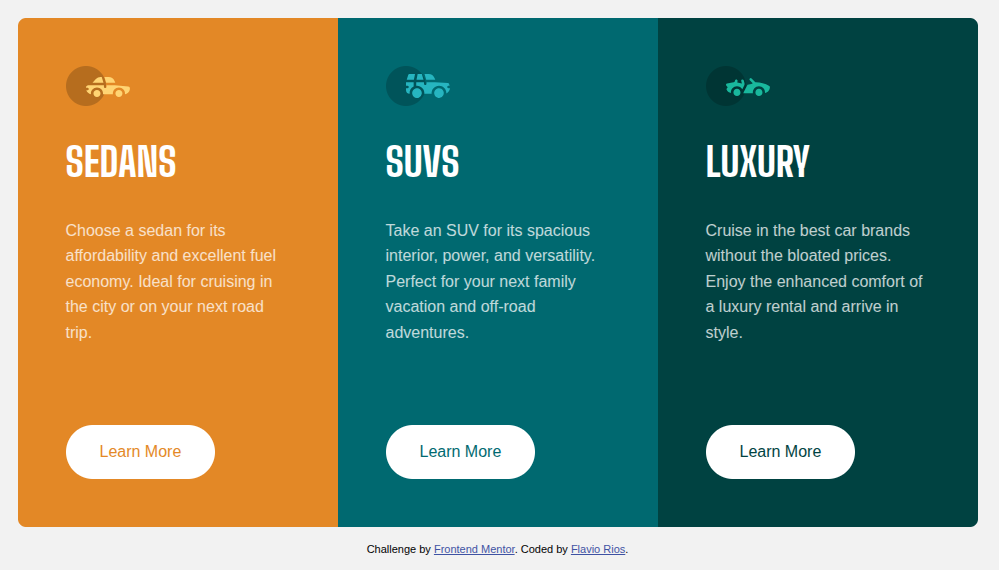

# Frontend Mentor - 3-column preview card component solution

This is a solution to the [3-column preview card component challenge on Frontend Mentor](https://www.frontendmentor.io/challenges/3column-preview-card-component-pH92eAR2-). Frontend Mentor challenges help you improve your coding skills by building realistic projects.

## Table of contents

* [Overview](#overview)
   * [The challenge](#the-challenge)
   * [Screenshot](#screenshot)
   * [Links](#links)
* [My process](#my-process)
   * [Built with](#built-with)
   * [What I learned](#what-i-learned)
   * [Continued development](#continued-development)
   * [Useful resources](#useful-resources)
* [Author](#author)
* [Acknowledgments](#acknowledgments)

## Overview

### The challenge

Users should be able to:

- View the optimal layout depending on their device's screen size
- See hover states for interactive elements

### Screenshot



### Links

- Live Site URL: [GitHub Pages](https://flaviovich.github.io/frontendmentor-3-column-preview-card/)

## My process

### Built with

- Semantic HTML5 markup
- CSS custom properties (CSS Variables)
- CSS Flexbox
- Mobile-first workflow
- Google Fonts (Big Shoulders & Lexend Deca)

### What I learned

During this project, I reinforced my understanding of:

- **CSS Custom Properties**: Using CSS variables for consistent theming and easy maintenance
- **Responsive Design**: Implementing mobile-first approach with media queries
- **Button Hover Effects**: Creating smooth transitions and solving the border-jump issue

Key code snippets I'm proud of:

```css
/* Preventing button size jump on hover */
.btn {
  border: 2px solid transparent;
}

.btn:hover {
  background-color: transparent;
  color: white;
  border: 2px solid white;
}
```

```css
/* Flexible layout switching */
@media (min-width: 1024px) {
  .container {
    flex-direction: row;
  }
}
```

### Continued development

Areas I want to continue focusing on:

- CSS Grid for more complex layouts
- Advanced CSS animations and transitions
- Accessibility improvements (ARIA labels, keyboard navigation)
- CSS methodologies like BEM for better organization

### Useful resources

- [MDN Web Docs - Flexbox](https://developer.mozilla.org/en-US/docs/Learn/CSS/CSS_layout/Flexbox) - Great reference for flexbox properties
- [CSS-Tricks - A Complete Guide to Flexbox](https://css-tricks.com/snippets/css/a-guide-to-flexbox/) - Comprehensive visual guide
- [Google Fonts](https://fonts.google.com/) - For typography selection and implementation

## Author

- Website - [Flavio Rios](https://github.com/flaviovich)
- Frontend Mentor - [@flaviovich](https://www.frontendmentor.io/profile/flaviovich)
- LinkedIn - [Flavio Rios Nieto](https://www.linkedin.com/in/flavio-rios-nieto/)

## Acknowledgments

Thanks to Frontend Mentor for providing this challenge and to the community for their helpful feedback and solutions that inspire continuous learning.