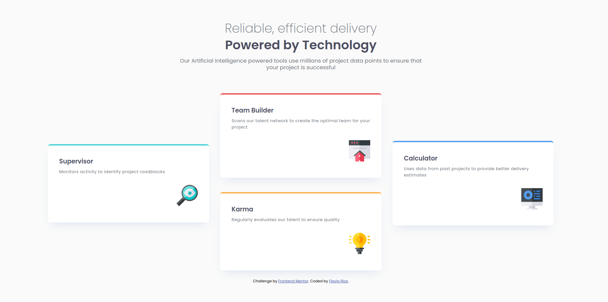

# Frontend Mentor - Four card feature section solution

This is a solution to the [Four card feature section challenge on Frontend Mentor](https://www.frontendmentor.io/challenges/four-card-feature-section-weK1eFYK). Frontend Mentor challenges help you improve your coding skills by building realistic projects. 

## Table of contents

- [Overview](#overview)
  - [The challenge](#the-challenge)
  - [Screenshot](#screenshot)
  - [Links](#links)
- [My process](#my-process)
  - [Built with](#built-with)
  - [What I learned](#what-i-learned)
  - [Continued development](#continued-development)
  - [Useful resources](#useful-resources)
- [Author](#author)

## Overview

### The challenge

Users should be able to:

- View the optimal layout for the site depending on their device's screen size

### Screenshot



### Links

- Solution URL: [GitHub](https://github.com/flaviovich/frontendmentor-challenges/tree/main/four-card-feature-section)
- Live Site URL: [GitHub Pages](https://flaviovich.github.io/frontendmentor-challenges/four-card-feature-section/)

## My process

### Built with

- Semantic HTML5 markup
- CSS custom properties
- Flexbox
- CSS Grid
- Mobile-first workflow

### What I learned

During this project, I reinforced my skills in responsive design using CSS Grid for complex layouts across different screen sizes. Achieving the four-card layout—where two cards span vertically on the sides in desktop view—was a great exercise in grid placement.

Here's an example of the desktop grid setup:

```css
.tools {
  display: grid;
  grid-template-columns: repeat(3, 1fr);
  grid-auto-rows: 1fr;
  gap: 2.25rem;
  align-items: center;
}

.card--cyan {
  grid-column: 1;
  grid-row: 1 / span 2;
}

.card--blue {
  grid-column: 3;
  grid-row: 1 / span 2;
}
```

I also practiced creating subtle box shadows and using HSL colors for consistency.

### Continued development

In future projects, I want to focus more on accessibility features, such as better ARIA labels and keyboard navigation, as well as exploring CSS variables for easier theming.

### Useful resources

- [CSS-Tricks Guide to CSS Grid](https://css-tricks.com/snippets/css/complete-guide-grid/) - Helped me master grid placement for this multi-column layout.
- [Frontend Mentor Community Solutions](https://www.frontendmentor.io/challenges/four-card-feature-section-weK1eFYK/solutions) - Reviewing other solutions gave me ideas for cleaner code and better responsiveness.

## Author

- Website - [Flavio Rios](https://www.linkedin.com/in/flavio-rios-nieto/)
- Frontend Mentor - [@flaviovich](https://www.frontendmentor.io/profile/flaviovich)