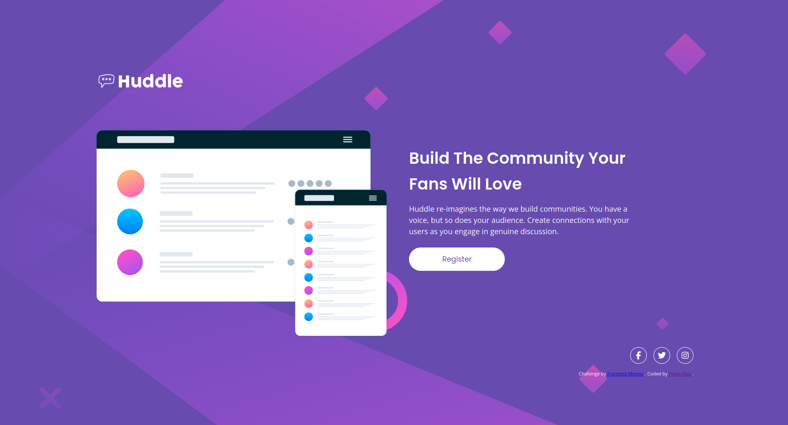

# Frontend Mentor - Huddle landing page with single introductory section solution

This is a solution to the [Huddle landing page with single introductory section challenge on Frontend Mentor](https://www.frontendmentor.io/challenges/huddle-landing-page-with-a-single-introductory-section-B_2Wvxgi0). Frontend Mentor challenges help you improve your coding skills by building realistic projects.

## Table of contents

- [Overview](#overview)
  - [The challenge](#the-challenge)
  - [Screenshot](#screenshot)
  - [Links](#links)
- [My process](#my-process)
  - [Built with](#built-with)
  - [What I learned](#what-i-learned)
  - [Continued development](#continued-development)
  - [Useful resources](#useful-resources)
- [Author](#author)

## Overview

### The challenge

Users should be able to:

- View the optimal layout for the page depending on their device's screen size
- See hover states for all interactive elements on the page

### Screenshots

### Links

- Solution URL: [GitHub](https://github.com/flaviovich/frontendmentor-challenges/tree/main/huddle-landing-page-with-single-introductory-section) <!-- actualiza con tu enlace real -->
- Live Site URL: [GitHub Pages](https://flaviovich.github.io/frontendmentor-challenges/huddle-landing-page-with-single-introductory-section/)

## My process

### Built with

- Semantic HTML5 markup
- CSS custom properties (variables)
- Flexbox
- Mobile-first workflow
- Font Awesome icons (for social media links)
- Google Fonts (Poppins + Open Sans)

### What I learned

This challenge was **the most difficult one so far** for me. Getting the layout to look good on both mobile and desktop — especially the arrangement of elements — took a lot of trial and error.

Some key things I learned or finally understood better:

- How to properly choose and adjust the layout of the main section (`.huddle-main`) using `flex-direction: column` on mobile and switching to `flex-direction: row` + `gap` on desktop.
- Font Awesome icons offer many useful properties (size with `font-size`, padding, centering, etc.), although in the end I removed some extra tweaks to keep things clean and simple.
- I now really understand the different values of the **`background-size`** property (`contain`, `cover`, percentages, etc.) and how they behave differently on mobile vs desktop backgrounds.
- The practical use of **`padding-block`** (and `margin-block`) to control vertical spacing in a more semantic and readable way.

### Continued development

In future projects I want to keep improving:

- Making faster and more confident decisions about complex layouts with Flexbox
- Better handling of relative units (rem/em) and how they scale across screen sizes
- Optimizing background images and performance without sacrificing quality
- Creating smoother, more consistent hover and transition effects

### Useful resources

- [KRuler](https://apps.kde.org/kruler) — An on-screen ruler tool that helped me enormously to measure spacing, sizes and distances directly against the design reference. Extremely useful when you don't have the original Figma/Sketch file open.

## Author

- Frontend Mentor - [@flaviovich](https://www.frontendmentor.io/profile/flaviovich)
- LinkedIn - [Flavio Rios](https://www.linkedin.com/in/flavio-rios-nieto/)
- Twitter / X - [@flaviovichDev](https://twitter.com/flaviovichDev)