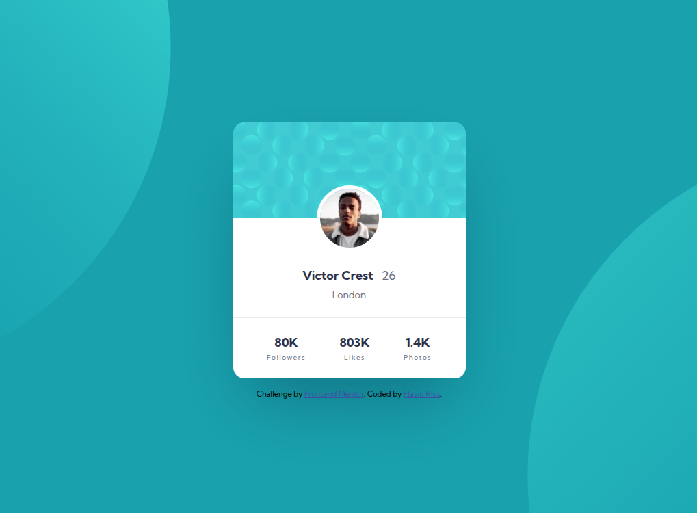

# Profile Card Component - Pure CSS Mobile First Solution

This is a solution to the [Profile card component challenge on Frontend Mentor](https://www.frontendmentor.io/challenges/profile-card-component-cfArpWshJ). Frontend Mentor challenges help you improve your coding skills by building realistic projects.

## Table of contents

- [Overview](#overview)
  - [The challenge](#the-challenge)
  - [Screenshot](#screenshot)
  - [Links](#links)
- [My process](#my-process)
  - [Built with](#built-with)
  - [What I learned](#what-i-learned)
  - [Continued development](#continued-development)
  - [Useful resources](#useful-resources)
- [Author](#author)
- [Acknowledgments](#acknowledgments)

## Overview

### The challenge

Users should be able to:

- View the optimal layout for the component depending on their device's screen size
- See a clean and modern profile card design with proper spacing and typography
- Experience smooth transitions and responsive behavior across all devices

### Screenshot



### Links

- Live Site URL: [GitHub Pages](https://flaviovich.github.io/frontendmentor-challenges/profile-card-component/index.html)

## My process

### Built with

- **Semantic HTML5 markup** - Clean and accessible structure
- **Pure CSS** - No frameworks or preprocessors used
- **CSS Custom Properties** - For consistent theming and maintainability
- **Flexbox** - For layout alignment and distribution
- **Mobile-first workflow** - Responsive design approach starting from mobile devices
- **BEM Methodology** - Block Element Modifier naming convention for CSS classes
- **Definition List Elements** - Semantic HTML for user stats and information

### What I learned

This project helped me reinforce several important concepts:

**BEM Methodology Implementation:**
```css
.profile-card { }
.profile-card__header { }
.profile-card__avatar { }
.profile-card__info { }
.profile-card__stats { }
.profile-card__stat-item { }
.profile-card__stat-item--followers { }
```

**Semantic HTML with Definition Lists:**
```html
<dl class="profile-card__stats">
  <div class="profile-card__stat-item">
    <dt class="profile-card__stat-value">80K</dt>
    <dd class="profile-card__stat-label">Followers</dd>
  </div>
  <div class="profile-card__stat-item">
    <dt class="profile-card__stat-value">803K</dt>
    <dd class="profile-card__stat-label">Likes</dd>
  </div>
  <div class="profile-card__stat-item">
    <dt class="profile-card__stat-value">1.4K</dt>
    <dd class="profile-card__stat-label">Photos</dd>
  </div>
</dl>
```

**Mobile First Responsive Design:**
```css
/* Mobile styles (base) */
.profile-card {
  width: 90%;
  max-width: 350px;
}

/* Tablet and up */
@media (min-width: 768px) {
  .profile-card {
    max-width: 400px;
  }
}

/* Desktop and up */
@media (min-width: 1024px) {
  .profile-card {
    max-width: 450px;
  }
}
```

**CSS Custom Properties for Theming:**
```css
:root {
  --color-primary: hsl(185, 75%, 39%);
  --color-secondary: hsl(229, 23%, 23%);
  --color-neutral-400: hsl(227, 10%, 46%);
  --color-neutral-100: hsl(0, 0%, 100%);
}
```

### Continued development

Areas I want to continue focusing on in future projects:

- **Background Image Positioning**: Need to improve the precise positioning of decorative background elements to match the design exactly
- **Advanced CSS Grid Techniques**: Exploring more complex grid layouts and alignment options
- **CSS Animation and Transitions**: Adding subtle micro-interactions to enhance user experience
- **Accessibility Improvements**: Better focus management and screen reader support
- **Performance Optimization**: Implementing more efficient CSS and optimizing image loading

### Useful resources

- [BEM Methodology](http://getbem.com/) - This helped me understand the Block Element Modifier naming convention for better CSS organization
- [MDN Definition Lists](https://developer.mozilla.org/en-US/docs/Web/HTML/Element/dl) - Great resource for understanding semantic HTML with definition lists
- [CSS-Tricks Mobile First](https://css-tricks.com/logic-in-media-queries/) - Excellent guide on mobile-first responsive design approach
- [MDN CSS Custom Properties](https://developer.mozilla.org/en-US/docs/Web/CSS/Using_CSS_custom_properties) - Comprehensive guide to CSS variables and theming
- [A11y Project](https://www.a11yproject.com/) - Helpful accessibility guidelines and best practices

## Author

- Website - [Flavio Rios](https://www.linkedin.com/in/flavio-rios-nieto/)
- Frontend Mentor - [@flaviovich](https://www.frontendmentor.io/profile/flaviovich)
- Twitter - [@flaviovichDev](https://www.twitter.com/flaviovichDev)

## Acknowledgments

Thanks to the Frontend Mentor community for providing feedback and inspiration. Special appreciation for the detailed design specifications that made this implementation possible.

---

*This project is part of my Frontend Mentor challenges collection. Check out my other solutions at [frontendmentor-challenges](https://github.com/flaviovich/frontendmentor-challenges).*