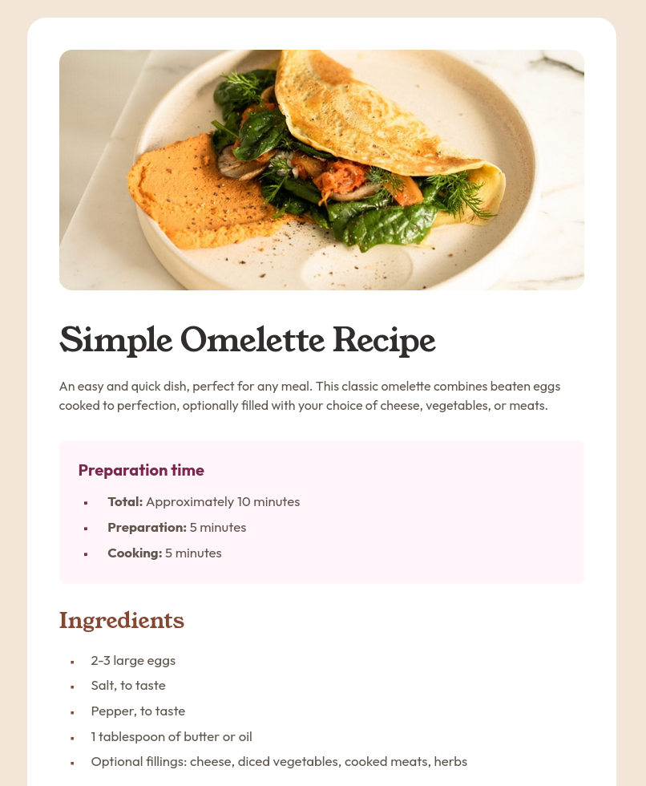

# Frontend Mentor - Recipe page solution

This is a solution to the [Recipe page challenge on Frontend Mentor](https://www.frontendmentor.io/challenges/recipe-page-KiTsR8QQKm). Frontend Mentor challenges help you improve your coding skills by building realistic projects.

## Table of contents

- [Overview](#overview)
  - [The challenge](#the-challenge)
  - [Screenshot](#screenshot)
  - [Links](#links)
- [My process](#my-process)
  - [Built with](#built-with)
  - [What I learned](#what-i-learned)
  - [Continued development](#continued-development)
  - [Useful resources](#useful-resources)
- [Author](#author)

## Overview

### The challenge

Users should be able to:

- View the optimal layout depending on their device's screen size
- See clearly structured recipe content with proper semantics

### Screenshot

### Links

- Solution URL: [https://github.com/flaviovich/frontendmentor-challenges/tree/main/recipe-page](https://github.com/flaviovich/frontendmentor-challenges/tree/main/recipe-page)
- Live Site URL: [GitHub](https://flaviovich.github.io/frontendmentor-challenges/recipe-page/)

## My process

### Built with

- Semantic HTML5 markup
- CSS custom properties
- Mobile-first workflow
- `@font-face` for custom fonts
- CSS variables for colors and typography
- Accessibility-focused techniques (WCAG 2.1)

### What I learned

This project was a great opportunity to deepen my understanding of **accessibility** (a11y).

Key learnings:

- How to implement proper semantic HTML structure (using `<article>`, `<section>`, `<dl>`, `<table>` with correct headers and scope)
- Adding **skip-to-main** link for keyboard navigation (WCAG 2.4.1)
- Meaningful `alt` text for images and `aria-labelledby` for sections
- Using `<caption>` + `scope="row"` in tables for screen reader support
- Visually-hidden utility class for accessible labels without visual clutter
- Focus management with consistent, visible `:focus-visible` styles
- Respecting `prefers-reduced-motion` to avoid unnecessary animations
- Ensuring sufficient touch target sizes and text spacing resilience (WCAG 1.4.10 / 1.4.12)

It helped me realize how small semantic and ARIA decisions make a huge difference for assistive technology users.

### Continued development

- Keep improving semantic HTML and ARIA usage in every project
- Test more regularly with screen readers (VoiceOver / NVDA)
- Explore CSS logical properties more deeply
- Build more complex layouts while maintaining full WCAG AA compliance

### Useful resources

- [WebAIM: Semantic Structure](https://webaim.org/techniques/semanticstructure/) – Great reference for choosing the right HTML elements
- [MDN Web Docs – Accessibility](https://developer.mozilla.org/en-US/docs/Web/Accessibility) – Excellent for understanding ARIA and focus management

## Author

- Frontend Mentor - [@flaviovich](https://www.frontendmentor.io/profile/flaviovich)
- LinkedIn - [Flavio Rios](https://www.linkedin.com/in/flavio-rios-nieto/)
- X / Twitter - [@flaviovichDev](https://twitter.com/flaviovichDev)
