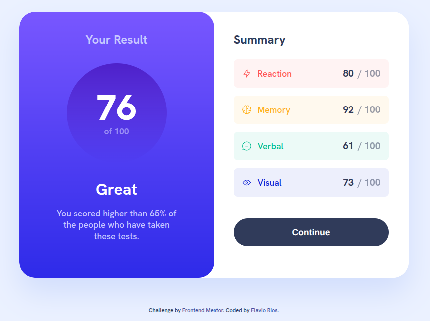

# Results Summary Component

A clean and responsive **Results Summary Component** built with HTML and CSS, following the design from [Frontend Mentor](https://www.frontendmentor.io). Displays a user's test results with a visual score breakdown and performance comparison.

## Overview

### The challenge

Users should be able to:

- View the optimal layout for the interface depending on their device's screen size
- See hover and focus states for all interactive elements on the page
- **Bonus**: Use local JSON data to dynamically populate the content *(not implemented in this version)*

### Screenshot



### Links

- Live Site URL: [GitHub](https://flaviovich.github.io/frontendmentor-challenges/results-summary-component/)

---

## My process

### Built with

- Semantic HTML5 markup
- CSS custom properties (CSS Variables)
- Flexbox
- Mobile-first workflow
- Responsive design with media queries
- Google Fonts (`Hanken Grotesk`)
- Accessible ARIA attributes

### What I learned

During this project, I deepened my understanding of:

```css
/* Gradient backgrounds with transparency */
background: linear-gradient(var(--violet-blue), var(--persian-blue));
```

```css
/* Responsive card layout using flexbox */
@media (min-width: 1024px) {
  .card {
    display: flex;
    max-width: 780px;
  }
}
```

Key takeaways:
- Using `hsla()` for subtle background tints
- Creating circular score elements with centered content
- Implementing smooth hover transitions on interactive elements
- Proper use of `aria-live` and `role` attributes for accessibility

### Continued development

Future improvements could include:

1. **Dynamic data loading** from a `data.json` file using JavaScript
2. **Animated score reveal** on page load
3. **Dark mode toggle**
4. **Export results as PDF**
5. **Progress comparison** with average or previous scores

### Useful resources

- [Frontend Mentor](https://www.frontendmentor.io) – Great platform for improving frontend skills
- [CSS Gradient Generator](https://cssgradient.io) – Helpful for creating complex gradients
- [A11y Project](https://www.a11yproject.com/) – Accessibility best practices
- [Kevin Powell](https://www.youtube.com/c/KevinPowell) – Excellent CSS tutorials

## Author

- Name: Flavio Rios
- LinkedIn: [Flavio Rios Nieto](https://www.linkedin.com/in/flavio-rios-nieto/)
- Frontend Mentor: [@flaviovich](https://www.frontendmentor.io/profile/flaviovich)
- Twitter: [@flaviovichDev](https://x.com/flaviovichDev)

## Acknowledgments

Special thanks to the **Frontend Mentor** community for the challenge and feedback. Also, shoutout to the developers who maintain open-source tools and resources that make projects like this possible.
