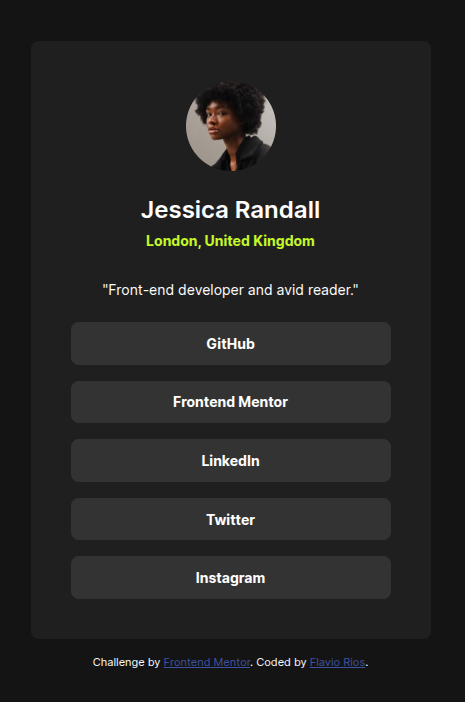

# Social Links Profile - Frontend Mentor Solution

## Overview

### The Challenge
Users should be able to:

- View the optimal layout for the interface depending on their device's screen size
- See hover and focus states for all interactive elements on the page
- Access a clean, modern social links profile page with smooth transitions

### Screenshot


### Links
- [GitHub Pages](https://flaviovich.github.io/frontendmentor-challenges/social-links-profile/)

## My Process

### Built With
- Semantic HTML5 markup
- CSS custom properties
- CSS Flexbox
- Mobile-first workflow
- BEM methodology for CSS
- Inter font family with variable font support
- Responsive design principles

### What I Learned

This project helped me reinforce my understanding of:

- **CSS Custom Properties (Variables)**: Used for consistent theming and easy maintenance
```css
:root {
  --color-green: hsl(75, 94%, 57%);
  --color-grey-700: hsl(0, 0%, 20%);
  --spacing-md: 1.5rem;
}
```

- **BEM Methodology**: Implemented a structured naming convention for CSS classes
```css
.profile__card {}
.profile__avatar {}
.profile__link {}
```

- **Variable Font Implementation**: Learned to implement and provide fallbacks for variable fonts
```css
@font-face {
  font-family: 'Inter';
  src: url('../fonts/Inter-VariableFont_slnt,wght.ttf') format('truetype-variations');
  font-weight: 400 600 700;
}
```

- **Accessibility Focus States**: Created accessible focus states for interactive elements
```css
.profile__link:focus {
  background-color: var(--color-green);
  color: var(--color-grey-900);
  outline: none;
}
```

### Continued Development

Areas I want to continue focusing on in future projects:

- Advanced CSS Grid layouts
- CSS animations and transitions
- JavaScript interactivity
- Performance optimization techniques
- Cross-browser compatibility testing

### Useful Resources

- [Inter Font Family](https://rsms.me/inter/) - The beautiful Inter font used in this project
- [BEM Methodology](http://getbem.com/) - Helpful for understanding BEM naming convention
- [CSS Variables Guide](https://developer.mozilla.org/en-US/docs/Web/CSS/Using_CSS_custom_properties) - MDN documentation on CSS custom properties
- [Frontend Mentor](https://www.frontendmentor.io) - Platform that provided this challenge

## Author
- Website - [Flavio Rios](https://www.linkedin.com/in/flavio-rios-nieto/)
- Frontend Mentor - [@flaviovich](https://www.frontendmentor.io/profile/flaviovich)
- Twitter - [@flaviovichDev](https://x.com/flaviovichDev)

## Acknowledgments

Thanks to Frontend Mentor for providing this challenge that helped me practice and improve my frontend development skills. Special thanks to the design community for inspiration and the developers who contribute to open-source resources that make learning web development more accessible.