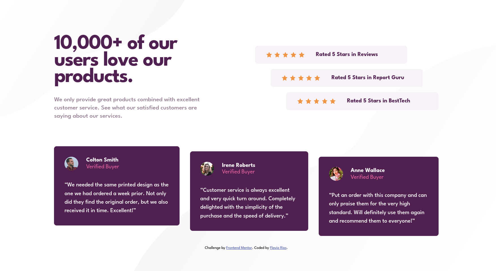

# Social Proof Section

A responsive "Social Proof Section" challenge from [Frontend Mentor](https://www.frontendmentor.io/challenges/social-proof-section-6e0qTv_bA).

Fully mobile-first and pixel-perfect solution built with pure HTML & CSS.

## Live Demo
[GitHub Pages](https://flaviovich.github.io/frontendmentor-challenges/social-proof-section/)

## Screenshots

**Desktop (1440px)**  

## Features
- Mobile-first responsive design
- Pixel-perfect match to the original design
- Staggered layout using offset classes (mobile + desktop)
- Semantic HTML5 with proper ARIA labels
- BEM-inspired CSS naming
- CSS custom properties for colors and fonts
- Optimized background patterns (mobile/desktop versions)
- Clean, atomic Git history

## Tech Stack
- HTML5
- CSS3 (vanilla, mobile-first)
- Google Fonts – League Spartan

## Challenge
[Frontend Mentor - Social proof section](https://www.frontendmentor.io/challenges/social-proof-section-6e0qTv_bA)
